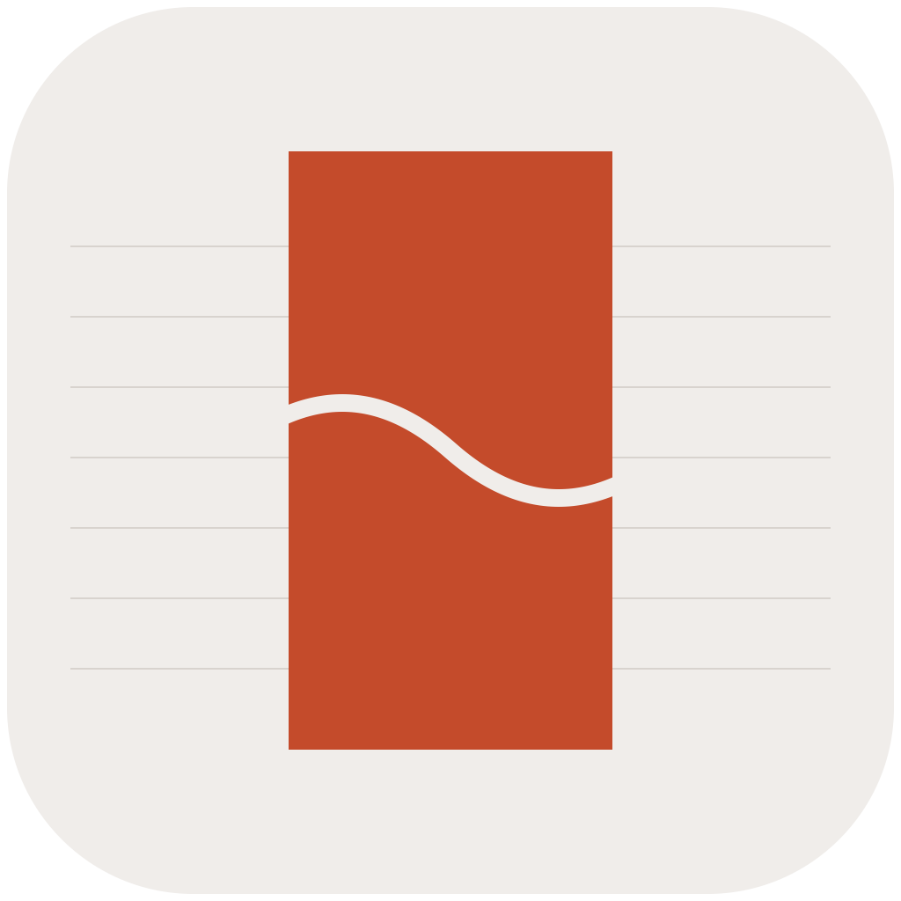

<!-- type: cover -->
# ColaMD Slides

---

## 用 --- 分隔每张幻灯片
这是第二张幻灯片。

每个 `---` 就是一张新幻灯片，`##` 是标题，段落之间空一行。

---

<!-- type: statement -->
## 想强调一句话？
在 slide 开头加 `<!-- type: statement -->`，标题会更大更突出。

---

## 插入图片
把图片放在 .md 文件同目录，用标准 Markdown 语法引用：

---

## 插入视频
把视频文件放在 .md 文件同目录，在 slide 开头指定：

`<!-- type: video, src: demo.mp4 -->`

<!-- type: video, src: demo.mp4 -->
## 视频示例
视频会自动居中显示，支持播放控制。

---
在封面 slide 指定 bg 参数，把图片放同目录即可：

`<!-- type: cover, bg: cover.png -->`

不加 bg 时封面自动用品牌配色。

---

## 全局配置（frontmatter）
文件顶部的三个字段控制全局样式：

`kicker` — 左上角品牌名

`chip` — 底部左侧标签（活动名称、日期）

`page` — 底部右侧署名

---

## 分享给朋友
菜单 File → Export Slides... 一键导出可分享版本。

不含视频：导出一个 .html 文件，朋友双击就能看，图片已内嵌。

含视频：导出一个文件夹，整个打包发送，朋友打开 index.html。

---

<!-- type: thankyou -->
## 开始你的演示
把这个文件的内容替换成你自己的

点击右上角 ▶ 一键全屏演示
